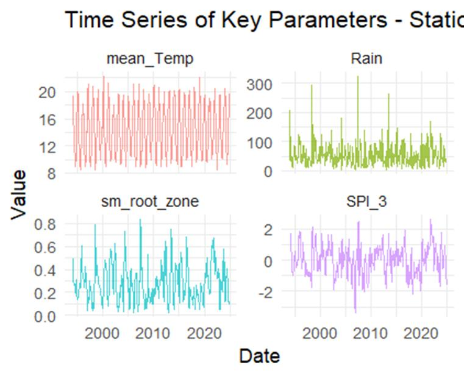
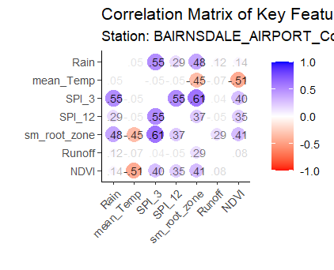
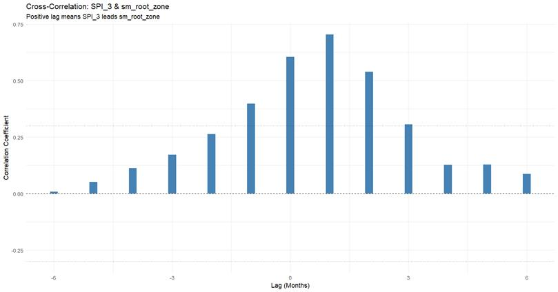
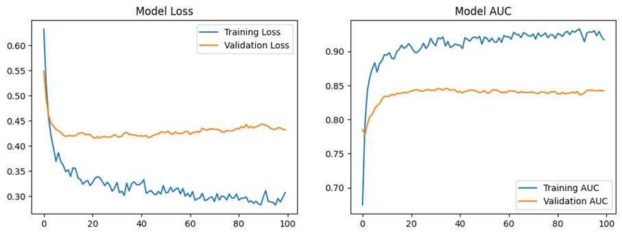
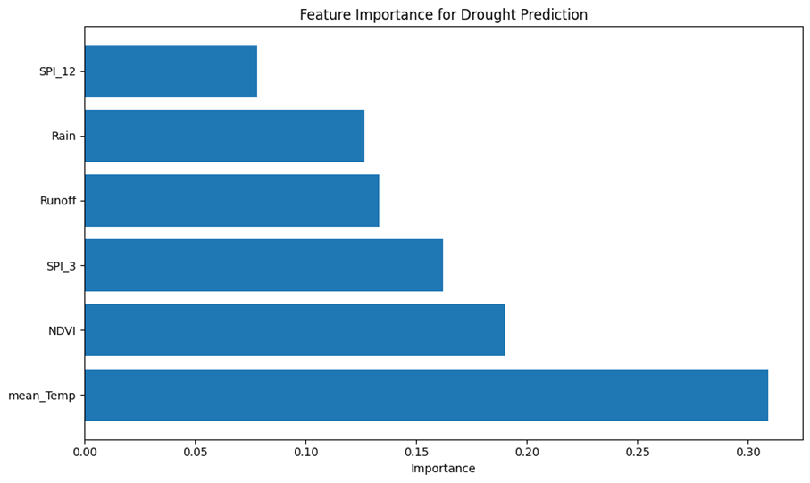
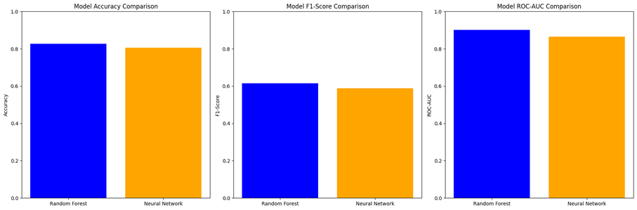
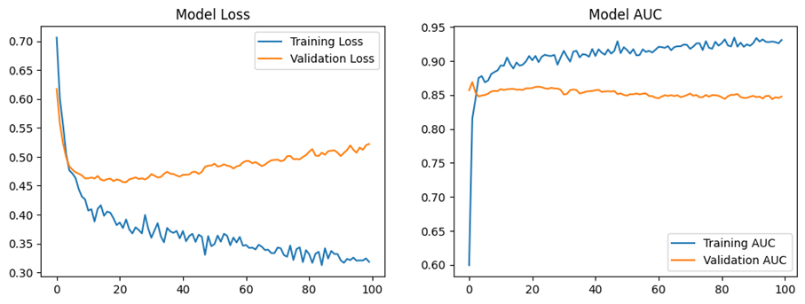
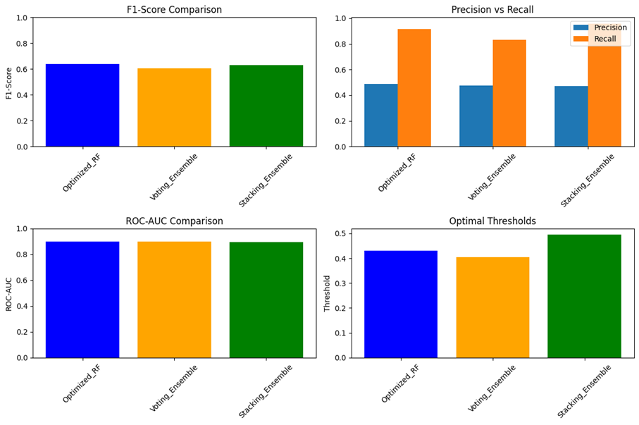

Introduction

Droughts can disrupt ecosystems, agriculture, and our water sources, sometimes in unexpected ways. For this project, we attempted to address the problem by developing a simple binary or a yes-or-no classifier to identify droughts monthly at specific stations, utilizing both climate and vegetation data. The EDA was executed entirely in R, while the model was trained and tested in Python.

Project Overview

This work builds a machine learning framework for predicting drought conditions across nine weather stations in Southeastern Australia, using climate and environmental data from 1994 to 2024. The work progressed through three main phases: data preparation in R, model development in Python/Colab, and evaluation of transfer learning.

Methodology

We follow a two-phase workflow:

1. Phase 1 (R): Data cleaning, SPI , and past-only drought labels.
2. Phase 2 (Python): chronological train/test split, class-weighted Random Forest (baseline), threshold calibration on a validation tail (from the training period), comparison to a small NN/ensembles, and transfer to a new station.

 

Methods and Results

This study builds a monthly, station-level drought event classifier for 9 chosen stations in Southeastern Australia for (1994–2024). Features are engineered in R, and models are trained in Python on a chronological split of 80% for training and 20% for testing. A month is labeled as a drought (1) when root-zone soil moisture drops below the expanding 20th percentile computed from past months only (the threshold is lagged one step, so the current month never “sees” itself).

Phase 1 — R data preparation and exploratory analysis

I ingested nine stations, forward-filled EVI/NDVI from the past only, and computed SPI-3 and SPI-12 with SPEI::spi() per station. After sorting by date, I created the drought label using an expanding quantile.

The correlation structure is consistent with hydrological intuition: SPI-3 and soil moisture are positively related, temperature opposes moisture, and vegetation greenness (NDVI) covaries with wetter conditions.

A  cross-correlation between SPI-3 and soil moisture peaks at a positive lag of about one to two months, suggesting short-term precipitation anomalies tend to lead root-zone response on that timescale.

Phase 2 — Model development on the source domain

I combined BAIRNSDALE_AIRPORT_Combined and MORWELL_LATROBE_VALLEY as source data, removed any rows with missing values in the six modeling features (SPI_3, SPI_12, mean_Temp, Rain, Runoff, NDVI) or the target, and obtained 722 complete station-months. The first 80% of the record trained the models; the last 20% (145 months) formed a strictly held-out test tail. Features were standardized using parameters fit only on the training split.

Two model families were trained: a class-weighted Random Forest and a compact neural network (dense layers with dropout). Because drought months are rare (~17% in the test tail), I calibrated the operating point with the precision–recall curve rather than default 0.5.

The Random Forest delivers strong ranking skill (ROC–AUC ≈ 0.90 on the test tail). With a recall-oriented threshold of about 0.30, it achieves F1 ≈ 0.615, accuracy ≈ 0.828, and recall ≈ 0.83 for drought months (precision ≈ 0.49). A small neural network, after class weighting and threshold tuning (~0.55), reaches ROC–AUC ≈ 0.865 and F1 ≈ 0.588. Time-series cross-validation inside the training period yields a mean F1 of ≈ 0.588, close to the held-out estimate.

Feature attribution aligns with domain knowledge. Temperature dominates, vegetation state and short-term wetness follow, while long-term SPI-12 adds comparatively little.

I also compared tuned ensembles and the optimized Random Forest remained the best overall, with ROC–AUC ≈ 0.901 and F1 ≈ 0.638 at its own PR-curve threshold (~0.43), narrowly outperforming both ensembles.

Transparency note. Some operating thresholds were explored on the test tail to study recall/precision trade-offs. This does not affect AUC, but F1/precision/recall may be slightly optimistic. In production, pick thresholds on a validation tail and report final metrics on the last, unseen period.

Phase 3 — Transfer to an unseen station and light fine-tuning

To assess spatial generalization, I applied the source-trained pipeline to GELANTIPY without retraining. With the source threshold, the model kept good ranking (ROC–AUC ≈ 0.822) but under-recalled drought months (F1 ≈ 0.448), a typical signature of domain shift. I then fine-tuned a Random Forest by augmenting the source training set with the first 30% of GELANTIPY’s history and retraining with the same architecture. This improvement in performance on GELANTIPY resulted in an accuracy of 0.856 and F1 ≈ of 0.662 at the same operating point, while recovering recall while preserving ranking skill.

Summary. Across two source stations, a tuned, class-weighted Random Forest provides reliable probability ranking (AUC ~0.90) and high-recall event detection once the threshold is calibrated. On a new station, simple recalibration—and, where available, a brief fine-tuning with early local data—substantially improves detection while maintaining strong discrimination.

 
